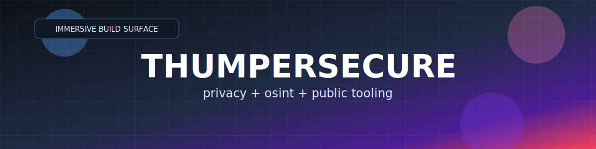

  
   
  
  
  

Public repos I built. No forks.

---

## Featured

   
  
  

   
  
  

   
  
  

<b>All Projects</b>

 

   
  
  

   
  
  

   
  
  

   
  
  

   
  
  

   
  
  

   
  
  

   
  
  

   
  
  

## Live Pulse

  
  
  

  

