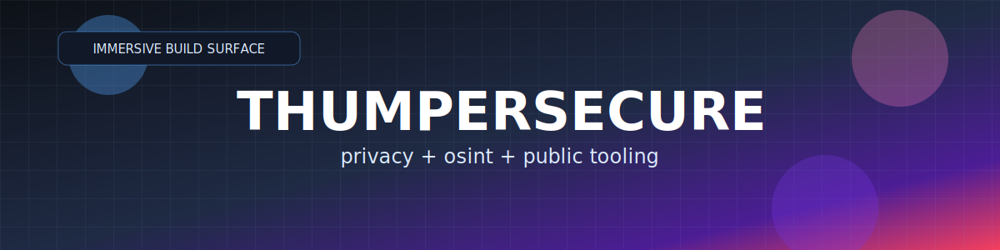

<div align="center">



<br />

# ⚡ THUMPERSECURE

### *A Collection for OSINT & Privacy*

```
╔═══════════════════════════════════════════════════════════════════╗
║           THUMPERSECURE //                                        ║
║              OSINT · Privacy · Recon · Automation                 ║
╚═══════════════════════════════════════════════════════════════════╝
```

*A collection for reconnaissance, privacy hardening, and digital footprint control—built for operators who value clarity over clutter.*

<br />

[](https://github.com/thumpersecure)
[](https://thumpersecure.github.io/thumpersecure/)
[](https://github.com/thumpersecure/Telespot)
[](https://github.com/thumpersecure/opt-out-manual-2026)

<br />

</div>

## 👤 Who It's For

| Profile | Use Case |
| :--- | :--- |
| 🔍 **Investigators & OSINT practitioners** | Researchers who need fast, reliable recon pipelines |
| 🛡️ **Privacy-conscious users** | Anyone actively reducing their digital footprint |
| ⚙️ **Developers & builders** | Teams crafting recon and workflow tooling |
| 👥 **Operators** | Repeatable, low-friction utilities they can trust |

---

<br>

## 🌐 Code Cookbook Site

The [live Code Cookbook](https://thumpersecure.github.io/thumpersecure/) is a cyberpunk-themed portfolio site hosted via GitHub Pages from the `/docs` folder. Audio on!

<br />

## 📄 License

Individual projects in the THUMPERSECURE ecosystem may have different licenses. Check each repository's `LICENSE` file for specifics. When in doubt, assume permissive open-source terms unless otherwise stated.

---

<br />

## 🙏 Acknowledgments

Thanks to the OSINT and privacy communities for ongoing research, feedback, and collaboration. THUMPERSECURE stands on the shoulders of open-source tooling and the practitioners who build in public.
