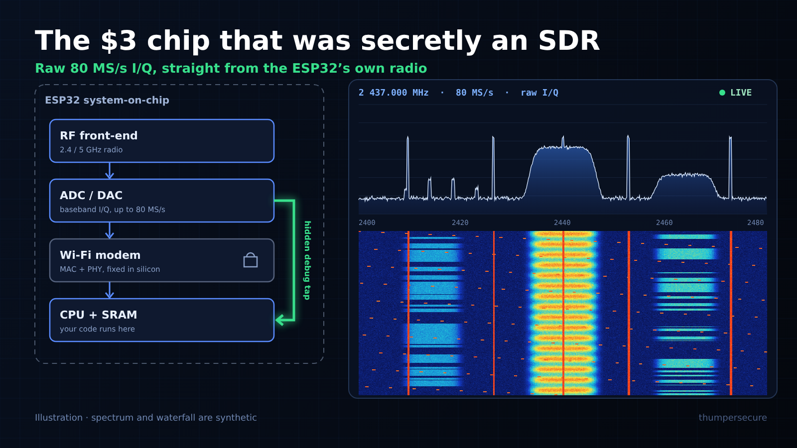

# The $3 Chip That Was Secretly a Software-Defined Radio

### Researchers found an undocumented debug path inside the ESP32 that streams raw 80 MS/s I/Q samples straight from the radio. Here's what was found, why it matters, and how to try it on a board you already own, in about ten minutes.

*By ThumperSecure · October 2026*

---

*Illustration: the hidden tap skips the Wi-Fi modem and puts raw radio samples straight into memory. The spectrum and waterfall are synthetic.*

The ESP32 is one of the most common microcontrollers on the planet. It's in smart plugs, light bulbs, hobby robots, badge projects, and millions of dev boards that cost less than a coffee. Everyone knows it has Wi-Fi and Bluetooth.

What nobody outside Espressif seems to have known until a few weeks ago is that **the radio inside it can also act as a software-defined radio (SDR).** There's an undocumented hardware path that copies the radio's raw baseband samples (the I/Q stream every SDR is built on) directly into the chip's memory, at up to **80 million samples per second.**

No extra hardware and no modified silicon. The capability has been sitting in the chip the whole time.

---

## What was discovered

The discovery came from **ESPARGOS**, a research project known for building phased arrays out of ESP32s to locate Wi-Fi transmitters. The team was digging through `librftest`, a closed-source library Espressif ships for factory and RF testing.

Using LLMs to help reverse-engineer a function called **`adctrig`**, they worked out how it configures a set of undocumented debug registers. With those registers set, the modem's **sample-dump engine** writes the radio ADC's raw I/Q samples straight into internal SRAM, **bypassing the Wi-Fi modem entirely**.

It's most likely a leftover from wafer-level factory testing, the kind of thing a chip vendor uses to check that every radio on a production line works. It was never meant to be a feature.

Then it got more interesting. **A Reddit user, h0m3us3r, independently found the same mechanism** and published it as [eSpDR](https://github.com/h0m3us3r/eSpDR). They also found a raw I/Q **transmit** playback engine: the same kind of debug path running the other direction, from memory out to the antenna.

Two unrelated groups landing on the same hidden feature within days of each other is a strong sign it's real and reproducible. [RTL-SDR.com](https://www.rtl-sdr.com/various-projects-independently-find-hidden-sdr-capabilities-in-esp32-microcontrollers/) rounded up the parallel projects, and [Hackaday](https://hackaday.com/2026/10/03/the-esp32-an-sdr-in-itself/) and [CNX Software](https://www.cnx-software.com/2026/10/04/esp-sdr-firmware-turns-esp32-into-a-2-4-5-ghz-software-defined-radio-sdr/) covered it in the first week of October 2026.

---

## Wait, didn't ESP32s already do "spectrum" stuff?

Sort of, and that's why some people are shrugging this off as old news. It isn't. Here's what was already possible and how it differs:

| Already known | What it gave you | Why it isn't this |
| :--- | :--- | :--- |
| **RSSI channel sweeps** | Power-per-Wi-Fi-channel "spectrum analyzers" | Coarse signal strength only, with no waveform |
| **Wi-Fi CSI** (Channel State Information) | Complex per-subcarrier channel estimates | Only for Wi-Fi frames the modem successfully decoded |
| **`librftest` factory functions** | Test tones, RX packet counters | Known for years, but never exposed raw samples |
| **New: raw I/Q tap** | **The actual baseband waveform, at up to 80 MS/s** | **Any signal in range, Wi-Fi or not** |

Raw I/Q is what makes something an SDR. With it you aren't limited to whatever the Wi-Fi modem decides to decode. You get the waveform itself and can demodulate, visualize, or analyze it however you like in software.

---

## The bandwidth problem, and the fix

80 MS/s of 32-bit I/Q works out to about **2.56 Gbit/s**. No ESP32 USB or UART link comes close to carrying that.

So the original ESPARGOS firmware works in **bursts**. It captures a short chunk into SRAM, runs an FFT **on the chip**, ships a compact spectrum snapshot to your computer, and repeats. That's fine for a waterfall display, but it left gaps of about **42 ms** between captures, during which the radio wasn't watching at all.

**Zoltan Doczi** then improved on this ([pull request](https://github.com/ESPARGOS/esp-sdr/pull/1)). His approach was a **ring buffer striped across three 64 KiB SRAM banks**, so the dump engine never stalls while the CPU is reading. On the ESP32-S3 the results were:

- **About 50× faster**: gapless spectrum at **roughly 1,300 spectra per second**
- The blind gap dropped **from ~42 ms to ~48 µs**
- The first **real, continuous (decimated) I/Q output, at 250 kS/s**, with a source module for **SDR++**

To show it was a real radio and not just a pretty waterfall, he received **FM broadcast radio** with it. An upconverter (a moRFeus) shifted 90.9 MHz up to 2350 MHz, where the ESP32 can tune, and it played.

---

## The practical limits (read these before you buy anything)

This isn't a HackRF replacement. It's a capable receiver at a very low price, with some caveats:

- **Mostly receive-only.** Transmit exists in the silicon, but it's experimental. ESPARGOS has deliberately *not* published TX support, citing misuse concerns.
- **Frequency coverage:** roughly **2.2–2.7 GHz** on most chips. The **ESP32-C5** adds **4.8–6.0 GHz**, which covers 5 GHz Wi-Fi, 5.8 GHz FPV video, and LTE Band 7 / 5G NR n7 nearby. To go lower (FM, VHF, UHF) you need an upconverter.
- **Usable bandwidth:** about **13–54 MHz**, depending on the chip (some up to ~69 MHz).
- **Burst vs. streaming:** most chips do burst captures or on-chip spectrum. Continuous streaming needs a fast link. The new **ESP32-S31** streams up to **20 MS/s over high-speed USB** or **40 MS/s over Gigabit Ethernet**, and works with GNU Radio and Gqrx through [SoapyESPSDR](https://github.com/ESPARGOS/SoapyESPSDR).
- **Not lab-grade.** Calibration, DC offset, I/Q imbalance and phase noise are all still being worked out by the community.

---

## How to get started (about 10 minutes, no soldering)

The easiest route is entirely in your browser. You don't need a toolchain, drivers, or a command line.

### What you need

1. **An ESP32 dev board.** Best picks:
   - **ESP32-S3** (e.g. ESP32-S3-DevKitC): native USB, fastest, gets the gapless "turbo" modes
   - **ESP32-C5**: the only one with **5 GHz** reception
   - **ESP32-C3 / C6 / C61**: cheap and widely available, and they work well
   - The original ESP32 also works, but over UART only (slower)
2. **A USB cable that carries data**, not just charge. This is the most common reason it "doesn't work."
3. **A desktop Chromium-based browser** (Chrome, Edge, Brave, Opera). The tools use **Web Serial**, which Firefox and Safari don't support.

### Step 1: Flash the firmware from your browser

1. Plug the board in. If it has two USB ports, use the one marked **USB** / native / JTAG rather than **UART**.
2. Open the web flasher: **[espargos.net/espsdr/app/flash.html](https://espargos.net/espsdr/app/flash.html)**
3. Choose your chip, click install, and pick your board's serial port when the browser asks.
4. If flashing won't start, hold the **BOOT** button while you plug the board in, then try again.

### Step 2: Power-cycle

Unplug the board, **wait about five seconds**, and plug it back in so it boots into the new firmware.

### Step 3: Open the receiver

1. Go to **[espargos.net/espsdr/app](https://espargos.net/espsdr/app/)**
2. Click **Connect** and choose the board.
3. You should see a live **power spectrum** and **waterfall**.

### Step 4: Things to try first

- **Watch Wi-Fi breathe.** Tune to **2412**, **2437** and **2462 MHz** (Wi-Fi channels 1, 6 and 11). Load a video on your phone and watch the bursts light up the waterfall.
- **Microwave oven test.** Tune to around **2450 MHz** and run a microwave for 30 seconds. You'll see a wide, sweeping smear. It's a satisfying first "I built a spectrum analyzer" moment.
- **Bluetooth hopping.** With a pair of earbuds streaming nearby, look for narrow, short blips scattered across 2402–2480 MHz.
- **Switch modes.** Compare **On-Chip Spectrum** (fast, continuous-looking) with raw snapshot capture, and try **AGC** vs. manual gain.
- **On an ESP32-C5:** flip to **5.5 GHz** and look at 5 GHz Wi-Fi or a 5.8 GHz FPV drone video transmitter.

### Step 5 (optional): Go further

- **Code:** the firmware is GPL-3.0 at **[github.com/ESPARGOS/esp-sdr](https://github.com/ESPARGOS/esp-sdr)**. It uses a plain-text serial protocol (`INFO`, `FREQ <MHz>`, `CAP16`, …), so it's easy to script from Python.
- **Desktop SDR apps:** for GNU Radio / Gqrx, look at **SoapyESPSDR** (ESP32-S31). For SDR++, follow the turbo-mode / 250 kS/s work in the esp-sdr pull requests.
- **The parallel project:** **[h0m3us3r/eSpDR](https://github.com/h0m3us3r/eSpDR)** takes a different, streaming-oriented approach on the ESP32-S3.

---

## A note on staying legal

**Receiving** is legal in most places, but laws on intercepting and *using* the contents of communications vary. Look at spectrum, not at other people's data. **Transmitting** is a different matter: raw-I/Q TX on Wi-Fi hardware can easily put out-of-spec or interfering signals on the air. Unless you're licensed (the 13 cm amateur band overlaps this range) and know exactly what you're emitting, don't transmit.

---

## Why this matters

- **SDR just got even cheaper.** A capable 2.4 GHz spectrum and I/Q tool now costs about as much as a sandwich, and many people already have one in a drawer.
- **Security research gets a new lens.** Spotting rogue transmitters, mapping Wi-Fi and BLE congestion, finding hidden cameras and trackers, and checking RF hygiene at a site survey are all now possible with an off-the-shelf microcontroller.
- **Education.** Students can now learn I/Q, FFTs, and modulation on a $3 chip instead of a $300 radio.
- **The method is notable too.** LLM-assisted reverse engineering of a closed vendor binary turned up a hardware capability that had been sitting in hundreds of millions of devices. That probably won't be the last such find.

Treating the ESP32 as an RF tool isn't new. What's new, and only about a month old, is that software can read **raw I/Q at 80 MS/s** out of the silicon through an undocumented tap. It's very early, and worth trying now while the community is still working out what the chip can do.

---

### Sources and further reading

- ESPARGOS — [ESP-SDR project page](https://espargos.net/espsdr/) · [IQ Sampling and SDR Mode](https://espargos.net/news/iq-sampling-and-sdr-mode/)
- GitHub — [ESPARGOS/esp-sdr](https://github.com/ESPARGOS/esp-sdr) · [ESPARGOS/SoapyESPSDR](https://github.com/ESPARGOS/SoapyESPSDR) · [h0m3us3r/eSpDR](https://github.com/h0m3us3r/eSpDR) · [Gapless ring capture PR](https://github.com/ESPARGOS/esp-sdr/pull/1)
- RTL-SDR.com — [Various Projects Independently Find Hidden SDR Capabilities in ESP32 Microcontrollers](https://www.rtl-sdr.com/various-projects-independently-find-hidden-sdr-capabilities-in-esp32-microcontrollers/)
- Hackaday — [The ESP32, An SDR In Itself](https://hackaday.com/2026/10/03/the-esp32-an-sdr-in-itself/) (Oct 3, 2026)
- CNX Software — [ESP-SDR firmware turns ESP32 into a 2.4/5 GHz SDR](https://www.cnx-software.com/2026/10/04/esp-sdr-firmware-turns-esp32-into-a-2-4-5-ghz-software-defined-radio-sdr/) (Oct 4, 2026)

*Tags: ESP32, Software Defined Radio, SDR, Reverse Engineering, Cybersecurity*
